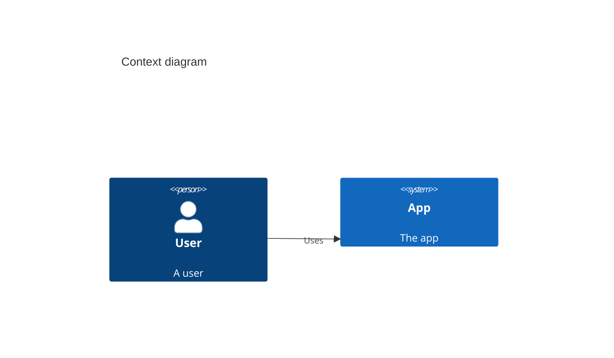

## Comparaison des outils

### PlantUML vs Mermaid vs Structurizr

---

### PlantUML

**✅ Avantages**

- Bibliothèque C4-PlantUML mature (depuis 2018)
- Support complet des 4 niveaux
- Génération PNG/SVG/PDF
- Large écosystème de plugins IDE

**❌ Inconvénients**

- Nécessite Java
- Syntaxe parfois verbeuse
- Rendu moins moderne

---

### PlantUML - Exemple

```plantuml
@startuml
!include C4_Context.puml

Person(user, "User", "A user")
System(app, "App", "The app")

Rel(user, app, "Uses", "HTTPS")
@enduml
```

**Verdict** : ⭐⭐⭐⭐⭐ Le plus complet et stable

---

### Mermaid

**✅ Avantages**

- Intégré nativement à GitHub/GitLab
- Pas besoin d'installation (render in-browser)
- Syntaxe plus simple
- Rendu moderne

**❌ Inconvénients**

- Support C4 encore expérimental
- Moins de features que PlantUML
- Customisation limitée

---

### Mermaid - Exemple



**Verdict** : ⭐⭐⭐⭐ Excellent pour débuter, limité pour l'avancé

---

### Structurizr

**✅ Avantages**

- Séparation Model vs Views ("Diagrams as Code 2.0")
- Un modèle → plusieurs vues
- Navigation interactive entre niveaux
- DSL propriétaire puissant

**❌ Inconvénients**

- Courbe d'apprentissage plus élevée
- Nécessite Docker (Structurizr Lite)
- Syntaxe spécifique à apprendre

---

### Structurizr - Concept

```
workspace {
  model {
    user = person "User"
    system = softwareSystem "App" {
      webapp = container "Web App"
      api = container "API"
    }
    user -> webapp
  }
  views {
    systemContext system
    container system
  }
}
```

**Verdict** : ⭐⭐⭐⭐ Puissant mais plus complexe

---

### Tableau récapitulatif

| Critère | PlantUML | Mermaid | Structurizr |
|---------|----------|---------|-------------|
| **Setup** | Moyen | Facile | Complexe |
| **C4 Support** | ✅ Complet | ⚠️ Partiel | ✅ Complet |
| **Intégration** | Plugins | Native GitHub | Docker |
| **Courbe apprentissage** | Moyenne | Faible | Élevée |
| **Maintenance** | Actif | Actif | Actif |

---

### Ma recommandation

**Pour débuter** : 🧜 **Mermaid**
- Essayez directement sur GitHub
- Pas d'installation
- Idéal pour Context et Container

**Pour aller plus loin** : 🌱 **PlantUML**
- Support complet C4
- Intégration CI/CD
- Génération d'images

**Pour les architectes** : 🏛️ **Structurizr**
- Architecture complexe
- Navigation interactive
- Multi-projets

---

### Ressources

📚 **PlantUML**
- https://c4model.com/
- https://github.com/plantuml-stdlib/C4-PlantUML

📚 **Mermaid**
- https://mermaid.js.org/syntax/c4.html

📚 **Structurizr**
- https://structurizr.com/
- https://github.com/structurizr/dsl

Note: Tous ces outils sont open source et gratuits
